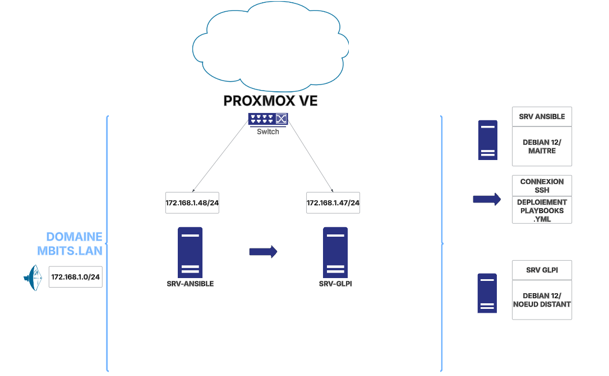

# Ansible - Déploiement automatisé de GLPI - Cloud privé Proxmox VE

Ce projet propose une solution automatisée pour déployer **GLPI 10.0.14** sur **Debian 12**, à l’aide d’**Ansible**, dans un environnement virtualisé sous **Proxmox VE**.

Chaque étape (installation, configuration, sécurisation HTTPS) est orchestrée par des **playbooks indépendants**.

---

## Schéma d’architecture



---

## Architecture

- **Hyperviseur** : Proxmox VE  
- **Réseau** : 172.168.1.0/24 (bridge)  
- **Domaine local** : mbits.lan  

### Machines virtuelles :

| Nom VM       | Rôle                    | OS         | IP             | RAM  | Disque |
|--------------|-------------------------|------------|----------------|------|--------|
| SRV-ANSIBLE  | Hôte de gestion Ansible | Debian 12  | 172.168.1.48   | 2 Go | 32 Go  |
| SRV-GLPI     | Serveur cible GLPI      | Debian 12  | 172.168.1.47   | 2 Go | 32 Go  |

---

## Prérequis

### GLPI :

- Apache2 (recommandé)
- MariaDB 10.11
- PHP 8.2 avec les extensions requises : `xml`, `json`, `zip`, `mbstring`, `curl`, `mysqli`, `pdo`, `intl`, `ldap`
- Accès en écriture sur `/var/www/html/glpi`
- OS : Debian 12

### Ansible (machine de gestion) :

- Debian 12
- Accès root ou utilisateur avec `sudo`
- Python 3
- Ansible (installé via dépôt sécurisé)
- Accès SSH aux machines distantes

---

## Documentation technique

Les étapes manuelles nécessaires à la mise en place de l’environnement sont documentées dans le dossier [`/docs`](./docs) :

- [`01_installation_configuration_ansible.md`](docs/01_installation_configuration_ansible.md) : installation d’Ansible, configuration initiale 
- [`02_configuration_utilisateur_ssh.md`](docs/02_configuration_utilisateur_ssh.md) : création de l’utilisateur distant `ansible` et mise en place de l’authentification SSH sans mot de passe

---

## Automatisation

Les playbooks ci-dessous sont exécutés depuis `SRV-ANSIBLE` pour installer et configurer automatiquement le serveur `SRV-GLPI` :

- [`01_install-glpi-deps.yml`](playbooks/01_install-glpi-deps.yml) : installation d’Apache2, PHP 8.2 et extensions requises
- [`02_mariadb-config.yml`](playbooks/02_mariadb-config.yml) : création de la base GLPI et de l’utilisateur SQL `mbits`
- [`03_download-glpi.yml`](playbooks/03_download-glpi.yml) : téléchargement et extraction de GLPI
- [`04_install-glpi-cli.yml`](playbooks/04_install-glpi-cli.yml) : installation de GLPI via `php bin/console`
- [`05_glpi-ssl.yml`](playbooks/05_glpi-ssl.yml) : génération de certificat SSL auto-signé et configuration Apache2 HTTPS

---

## Structure du dépôt

```
Ansible-glpi-debian12/
├── captures/
│   └── schema-ansible-glpi.png
│
├── docs/
│   ├── 01_installation_configuration_ansible.md
│   ├── 02_configuration_utilisateur_ssh.md
    ├── 03_playbooks.md
│
├── inventory/
│   └── hosts
│
├── playbooks/
│   ├── 01_install-glpi-deps.yml
│   ├── 02_mariadb-config.yml
│   ├── 03_download-glpi.yml
│   ├── 04_install-glpi-cli.yml
│   └── 05_glpi-ssl.yml
│
├── .gitignore
└── README.md
```

---

## Objectifs atteints

- Déploiement 100 % automatisé de GLPI 10.0.15
- Mise en place sécurisée d’un serveur Apache2, MariaDB, PHP 8.2
- Installation CLI sans interaction
- Génération et intégration d’un certificat SSL auto-signé
- Communication SSH sans mot de passe via Ansible

---

## Références

- [GLPI – Site officiel](https://glpi-project.org/)
- [Ansible – Documentation officielle](https://docs.ansible.com/)
- [MariaDB – Knowledge Base](https://mariadb.com/kb/)
